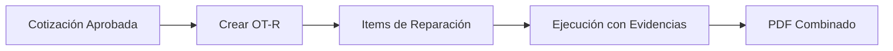

# Arquitectura del Sistema ASC

## Visión General

ASC es un sistema de gestión de mantenimiento industrial multi-tenant construido con una arquitectura moderna de microservicios. El sistema está diseñado para ser escalable, seguro y fácil de mantener.

## Stack Tecnológico

### Frontend
- **Next.js 14**: Framework React con App Router
- **TypeScript**: Tipado estático
- **Tailwind CSS**: Framework de estilos utilitarios
- **React Query**: Gestión de estado del servidor
- **NextAuth.js**: Autenticación
- **Recharts**: Gráficos y visualizaciones

### Backend
- **NestJS**: Framework Node.js con TypeScript
- **Prisma**: ORM y generador de cliente de base de datos
- **PostgreSQL**: Base de datos relacional
- **Redis**: Cache y gestión de sesiones
- **JWT**: Tokens de autenticación
- **Swagger**: Documentación de API

### Infraestructura
- **Docker**: Contenedorización
- **Docker Compose**: Orquestación local
- **MinIO**: Almacenamiento S3-compatible
- **GitHub Actions**: CI/CD

## Arquitectura Multi-tenant

### Row-Level Security (RLS)

El sistema implementa multi-tenancy usando Row-Level Security de PostgreSQL:

```sql
-- Función para obtener empresa_id del contexto
CREATE OR REPLACE FUNCTION get_current_empresa_id() RETURNS UUID AS $$
BEGIN
  RETURN COALESCE(
    NULLIF(current_setting('app.empresa_id', true), '')::UUID,
    '00000000-0000-0000-0000-000000000000'::UUID
  );
END;
$$ LANGUAGE plpgsql SECURITY DEFINER;

-- Política RLS ejemplo
CREATE POLICY usuarios_empresa_policy ON usuarios
  FOR ALL USING (empresa_id = get_current_empresa_id());
```

### Aislamiento de Datos

1. **Todas las tablas** incluyen `empresa_id`
2. **RLS habilitado** en todas las tablas (excepto `empresas`)
3. **Contexto automático** establecido en cada request
4. **Validación en guards** para prevenir acceso cruzado

## Autenticación y Autorización

### Flujo de Autenticación

1. **Login multi-tenant**: `empresa_code` + `username` + `password`
2. **Validación**: Verificar empresa activa y usuario válido
3. **JWT**: Generar access token (15min) y refresh token (7 días)
4. **Contexto**: Establecer `empresa_id` para RLS

### RBAC (Control de Acceso Basado en Roles)

```typescript
enum Role {
  ADMIN = 'admin',           // Acceso completo
  LIDER_EQUIPO = 'lider_equipo', // Gestión y asignaciones
  TECNICO = 'tecnico'        // Ejecución (sin precios)
}
```

### Guards de Seguridad

- **JwtAuthGuard**: Validar token y establecer contexto
- **RolesGuard**: Verificar permisos por rol
- **EmpresaGuard**: Validar acceso a recursos de empresa

## Módulos del Sistema

### Core Modules

#### 1. Clientes y Activos
- **CRUD completo** con validaciones
- **Importación CSV** con procesamiento batch
- **Bitácora automática** de cambios
- **QR/NFC** para identificación

#### 2. Formularios Dinámicos
- **Builder drag-and-drop** para crear formularios
- **Tipos de campo**: text, number, date, select, multiselect, checklist, photo, signature
- **Validaciones**: requerido, formato, dependencias
- **Ámbitos**: mantenimiento, inspección, emergencia, reparación

#### 3. Cotizaciones Colaborativas
- **Flujo colaborativo**: Técnico agrega → Líder asigna precios → Envío
- **Estados**: Borrador → En revisión → Lista envío → Enviada → Aprobada/Rechazada → Cerrada
- **Visibilidad**: Precios ocultos para técnicos
- **PDF**: Generación automática con branding

#### 4. Órdenes de Trabajo
- **Máquina de estados**: Nueva → Asignada → En curso ↔ En espera → Cerrada/Cancelada
- **Tipos**: Mantenimiento, Reparación, Emergencia, Inspección
- **Formularios**: Dinámicos según tipo
- **Evidencias**: Fotos, firmas, tiempos

#### 5. Emergencias con SLA
- **Métricas SLA**: hora_llamada → hora_asignación → hora_llegada → hora_cierre
- **Estados**: Llamada → Asignada → En ruta → En sitio → Resuelta → Cerrada
- **Alertas**: Notificaciones por incumplimiento SLA

### Business Logic

#### Cotizaciones → Reparaciones


#### Planes de Mantenimiento
- **Periodicidades**: Mensual, Trimestral, Semestral, Anual, Custom
- **Generación automática** de OTs
- **Calendario** de mantenimientos
- **Cobertura** realizado vs planificado

## Dashboard y KPIs

### Métricas Principales
- **SLA Promedio**: % de cumplimiento de tiempos
- **% Equipos Detenidos**: Activos no operativos
- **Cobertura Mantenimiento**: Realizado vs Planificado
- **Cotizaciones Abiertas**: Pendientes de cierre

### Filtros Globales
- **MES**: Aplica a todos los KPIs
- **CLIENTE**: Filtra por cliente específico

### Visualizaciones
- **Gráfico diario**: Actividad de mantenimientos, reparaciones, emergencias
- **Tablas dinámicas**: Activos detenidos, próximas mantenciones, cotizaciones abiertas
- **Tiempo detenido**: Por activo con % del período

## API Externa v1

### Autenticación
- **JWT con scope** por empresa_id
- **Rate limiting**: 100 req/min por defecto
- **Audit log**: Registro de todas las llamadas

### Endpoints Principales
```typescript
GET /api/v1/activos/{id}/estado
GET /api/v1/reportes/mensual?cliente_id=&mes=
GET /api/v1/metricas/kpis?desde=&hasta=
POST /api/v1/webhooks
```

### Documentación
- **OpenAPI 3.0**: Especificación completa
- **Swagger UI**: Interfaz interactiva
- **SDKs**: Generación automática

## Gestión Documental

### Almacenamiento
- **S3-compatible**: MinIO para desarrollo, AWS S3 para producción
- **Organización**: `/empresa_id/tipo/año/mes/archivo`
- **Metadatos**: Tipo, tamaño, usuario, fecha, permisos

### Tipos de Documentos
- **Evidencias**: Fotos de mantenimientos/reparaciones
- **Firmas**: Digitales con hash de validación
- **PDFs**: Cotizaciones, reportes, certificados
- **Importaciones**: CSVs de activos/clientes

## Seguridad

### Principios
1. **Defense in Depth**: Múltiples capas de seguridad
2. **Least Privilege**: Mínimos permisos necesarios
3. **Zero Trust**: Validar todo acceso

### Implementación
- **HTTPS**: Obligatorio en producción
- **CORS**: Configuración restrictiva
- **Helmet**: Headers de seguridad
- **Rate Limiting**: Protección contra abuso
- **Input Validation**: Sanitización de datos
- **SQL Injection**: Prevención con Prisma ORM

## Performance

### Optimizaciones
- **Índices**: En campos de búsqueda frecuente
- **Cache**: Redis para datos frecuentes
- **Paginación**: En listados grandes
- **Lazy Loading**: Carga bajo demanda
- **CDN**: Para assets estáticos

### Monitoreo
- **Health Checks**: Endpoints de salud
- **Métricas**: Prometheus/Grafana
- **Logs**: Structured logging
- **APM**: Application Performance Monitoring

## Escalabilidad

### Horizontal Scaling
- **Stateless**: API sin estado local
- **Load Balancer**: Distribución de carga
- **Database**: Read replicas
- **Cache**: Redis Cluster

### Vertical Scaling
- **Resource Limits**: CPU/Memory por contenedor
- **Auto-scaling**: Basado en métricas
- **Database**: Connection pooling

## Deployment

### Ambientes
- **Development**: Docker Compose local
- **Staging**: Kubernetes cluster
- **Production**: Kubernetes con HA

### CI/CD Pipeline
1. **Lint & Type Check**
2. **Unit Tests**
3. **Integration Tests**
4. **Security Scan**
5. **Build & Push**
6. **Deploy**
7. **Health Check**

### Rollback Strategy
- **Blue-Green**: Deployment sin downtime
- **Database**: Migrations backward compatible
- **Feature Flags**: Rollback instantáneo

## Monitoring y Observabilidad

### Logs
```typescript
// Structured logging
logger.info('User login', {
  userId: user.id,
  empresaId: user.empresaId,
  ip: req.ip,
  userAgent: req.headers['user-agent']
});
```

### Métricas
- **Business**: KPIs del negocio
- **Technical**: Performance, errors, latency
- **Infrastructure**: CPU, memory, disk, network

### Alertas
- **SLA**: Incumplimiento de tiempos
- **Errors**: Rate de errores alto
- **Performance**: Latencia elevada
- **Infrastructure**: Recursos agotados

## Backup y Disaster Recovery

### Backup Strategy
- **Database**: Daily full + continuous WAL
- **Files**: S3 cross-region replication
- **Configuration**: Git repository

### Recovery Procedures
- **RTO**: Recovery Time Objective < 4 horas
- **RPO**: Recovery Point Objective < 1 hora
- **Testing**: Monthly disaster recovery drills

## Compliance y Auditoría

### Audit Trail
- **User Actions**: Todas las acciones de usuario
- **Data Changes**: Cambios en datos críticos
- **System Events**: Login, logout, errors
- **API Calls**: Llamadas a API externa

### Data Privacy
- **GDPR**: Cumplimiento de regulaciones
- **Data Retention**: Políticas de retención
- **Anonymization**: Anonimización de datos sensibles

## Roadmap Técnico

### Fase 1 (Actual)
- ✅ Core functionality
- ✅ Multi-tenant architecture
- ✅ Basic reporting

### Fase 2 (Q1 2025)
- 🔄 Mobile app (React Native)
- 🔄 Advanced analytics
- 🔄 IoT integration

### Fase 3 (Q2 2025)
- ⏳ AI/ML predictions
- ⏳ Advanced workflows
- ⏳ Third-party integrations

---

**Última actualización**: Septiembre 2024  
**Versión**: 0.5.0
